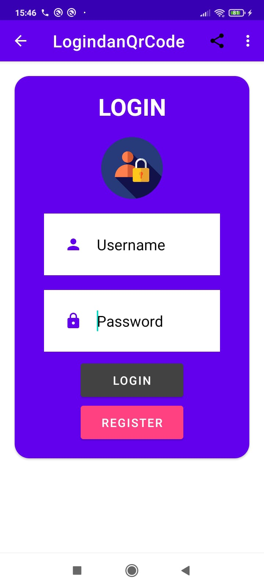

# Fahrijal Syawaludin_6706213040_D3IF-45-03

# Aplikasi Login dan QR Code Generator Update 2.0
Aplikasi Login dan QR Code Generator adalah aplikasi berbasis Android yang memungkinkan pengguna untuk melakukan login ke sistem, bisa Mengedit atau Menghapus Data yang sudah Login dan menghasilkan kode QR dengan mudah.

# Cara Penggunaan
Untuk menggunakan aplikasi ini, ikuti langkah-langkah berikut:

1. Buka aplikasi Login dan QR Code Generator pada perangkat Android Anda.
2. Untuk melakukan login, masukkan nama pengguna dan kata sandi Anda pada layar login.
3. Setelah login berhasil, pengguna dapat memilih opsi "Data Pengguna" pada Halaman Pertama dan pada Halaman Kedua ada "Generate QR Code".
5. Masukkan data yang ingin dijadikan QR Code, seperti URL atau teks, pada kolom yang disediakan.
6. Klik tombol "Generate" untuk menghasilkan kode QR.
7. Kode QR dapat disimpan pada perangkat Android Anda atau dibagikan dengan orang lain melalui aplikasi atau platform sosial media.

# Fitur
Aplikasi Login dan QR Code Generator memiliki fitur-fitur berikut:

1. Login yang aman dan mudah dilakukan.
2. Dapat mengganti Nama User dan Password.
3. Dapat Menghapus User dan Password.
4. Memiliki Navigasi untuk Share dan About.
5. Kemampuan menghasilkan kode QR dengan cepat dan mudah.
6. Kemampuan menyimpan kode QR pada perangkat atau membagikannya dengan mudah.
7. Tampilan antarmuka yang ramah pengguna dan mudah digunakan.

# Tampilan:
# Splash Screen:

# Halaman Register:

# Halaman Login:

# Halaman Data Login:

# Halaman Edit:

# Halaman QrCode:

# Navigasi About:

# Halaman About:

# Navigasi Share:

# Dependensi
Aplikasi ini menggunakan dependensi berikut:

1. Google Play Services: digunakan untuk menghasilkan kode QR.
2. Android Support Library: digunakan untuk menangani antarmuka pengguna.